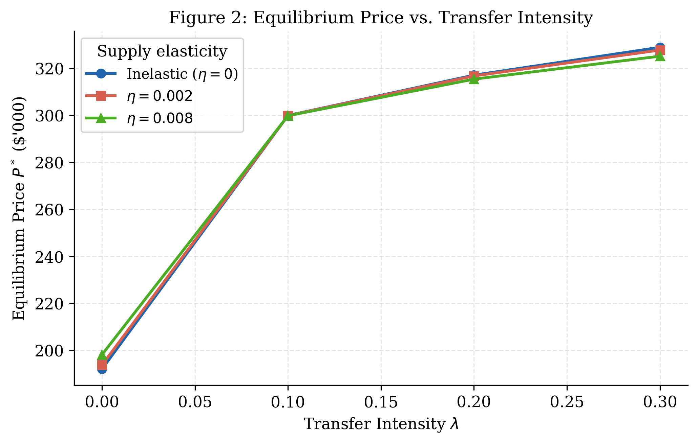
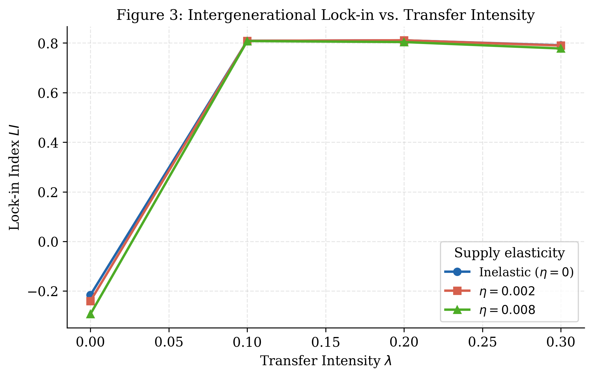
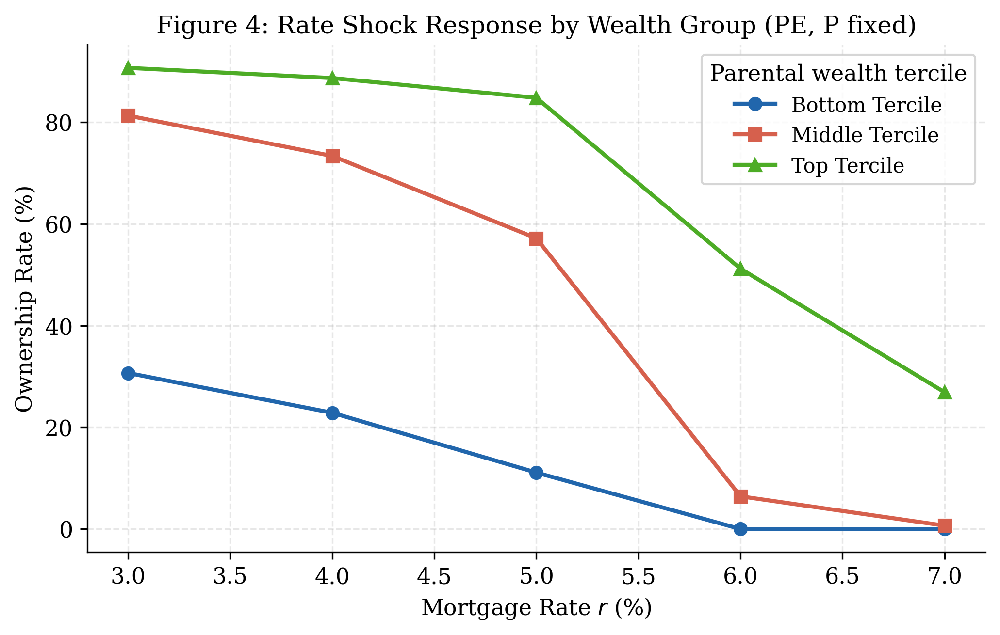

# Intergenerational Wealth Lock-in and Housing Affordability

> A theoretical OLG model with Python simulations studying how parental wealth transfers create homeownership lock-in, amplify price-to-income ratios, and generate nonlinear sensitivity to mortgage rate shocks.

---

## Authors

| Name | Contact | Web |
|---|---|---|
| **Simon-Pierre Boucher** | [spbou4@protonmail.com](mailto:spbou4@protonmail.com) | [spboucher.ai](https://www.spboucher.ai) |
| **Claude (Anthropic)** | AI co-author | [claude.ai](https://claude.ai) |

---

## Key Metrics — Baseline Calibration

| Metric | Value |
|---|---|
|  | $300,000 |
|  | 51.3% |
|  | 0.809 (top vs bottom quintile) |
|  | 4.95× |
|  | 5,000 simulated households |
|  | Fully reproducible (seed = 42) |

---

## Repo Badges


---

## Research Question

> *How do intergenerational wealth transfers (gifts, co-signing, inheritances) create **lock-in** dynamics in homeownership when housing is leveraged and credit constraints bind — especially under interest-rate shocks?*

---

## Model at a Glance

A **two-generation OLG model** where child households are heterogeneous in income $y_i$ and parental wealth $W^p_i$, subject to simultaneous credit constraints:

| Constraint | Formula | Who it hurts |
|---|---|---|
| **LTV** (down-payment) | $d_i \geq \chi P h$ | Low-savings / low-transfer households |
| **DSTI** (debt-service) | $m \cdot \alpha(r,T) \leq \psi y_i$ | Low-income households with large mortgages |

Parental gifts $g_i = \min(\lambda W^p_i, \bar{g})$ relax **both** constraints simultaneously.

---

## Three Core Propositions

| # | Proposition | Result |
|---|---|---|
| A | **Constraint Relaxation** | $\partial o^* / \partial g \geq 0$ — transfers monotonically expand ownership |
| B | **Intergenerational Lock-in** | LI is monotone increasing in $\lambda$; GE amplifies under inelastic supply |
| C | **Convex Rate Sensitivity** | DSTI-constrained households face accelerating ownership loss as $r$ rises |

---

## Simulation Results

### Price vs. Transfer Intensity


### Lock-in Index vs. Transfer Intensity


### Ownership by Parental Wealth Decile


### Rate Shock Response by Wealth Group


---

## Comparative Statics Summary

| Shock | Price $P^*$ | Ownership rate | Lock-in index LI |
|---|---|---|---|
| ↑ Transfer intensity $\lambda$ | ↑ | ↑ (top), mixed (bottom) | ↑ |
| ↑ Mortgage rate $r$ | ↓ | ↓ (DSTI-bound, convex) | ↑ |
| ↑ Supply elasticity $\eta$ | Attenuated | Attenuated | ↓ |
| Stricter LTV ↑ $\chi$ | ↓ | ↓ marginal buyers excluded | ↑ |

---

## File Structure

```
paper1/
├── simulate.py              # Full simulation (all experiments)
├── paper.tex                # LaTeX paper (31 pages)
├── paper.pdf                # Compiled PDF
├── README.md                # This file
├── KEY_MECHANISMS.md        # One-page mechanism summary
├── REPRODUCIBILITY.md       # Reproducibility checklist
└── output/
    ├── fig1_ownership_by_decile.{pdf,png}
    ├── fig2_price_vs_lambda.{pdf,png}
    ├── fig3_lockin_vs_lambda.{pdf,png}
    ├── fig4_rate_response.{pdf,png}
    ├── grid_results.csv
    ├── baseline_summary.csv
    ├── rate_lam_ownership_rate.csv
    ├── rate_lam_lock_in_index.csv
    └── rate_lam_PTI.csv
```

---

## Quickstart

```bash
# 1. Install dependencies
pip install numpy scipy pandas matplotlib

# 2. Run simulation (generates all figures + tables)
python3 simulate.py

# 3. Compile paper (requires MacTeX / TeX Live)
pdflatex paper.tex
pdflatex paper.tex   # second pass for cross-references
```

Expected runtime: **5–15 minutes** on a modern laptop.

---

## Parameters (Baseline)

| Parameter | Symbol | Value |
|---|---|---|
| Population | $N$ | 5,000 |
| Mortgage rate | $r$ | 5% |
| LTV floor | $\chi$ | 10% |
| DSTI cap | $\psi$ | 36% |
| Transfer intensity | $\lambda$ | 10% |
| Supply elasticity | $\eta$ | 0 (inelastic) |
| Loan term | $T$ | 30 years |
| Target price | $\bar{P}$ | $300,000 |
| Random seed | — | 42 |

---

## Welfare Punchline

Transfers are **privately efficient** but **not socially efficient** under inelastic supply: the general-equilibrium price externality imposed on non-recipients may more than offset aggregate gains. Supply-side reform (↑ $\eta$) Pareto-dominates demand-side interventions.

---

*Working paper — February 2026. All results reproducible with `numpy ≥ 1.24`, `seed = 42`.*
